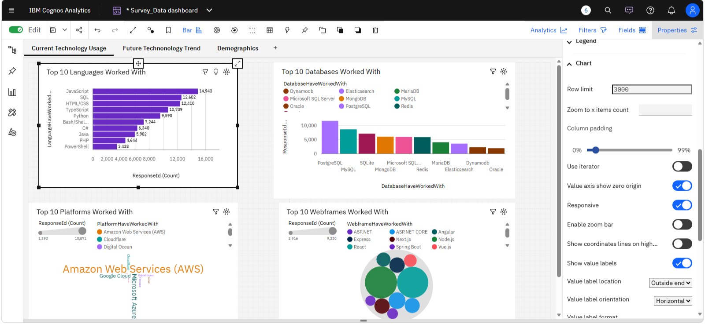
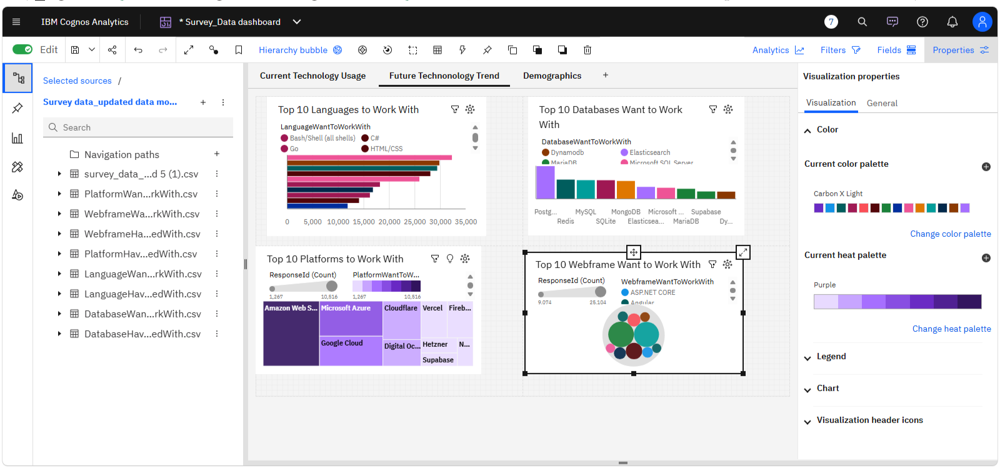
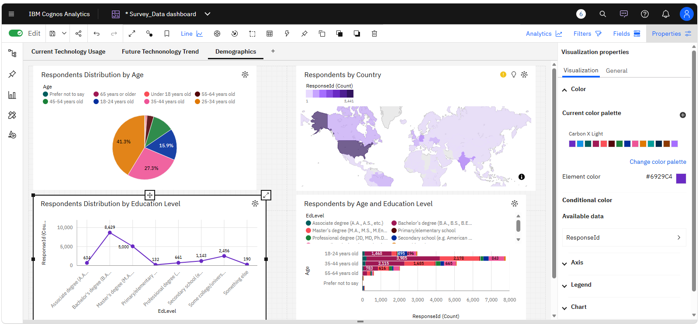

# 📊 Stack Overflow Developer Survey Analytics

This project demonstrates an end-to-end data analytics workflow from data cleaning to dashboard-driven insights.

## 🔍 Overview

This project analyses the Stack Overflow Developer Survey dataset to uncover:
- Current technology usage
- Future technology trends
- Developer demographics

It demonstrates an end-to-end data analytics workflow including data cleaning, transformation, modelling, and dashboard development.

---

## 🛠️ Tools & Technologies

- Excel & Power Query
- SQL
- Python (Jupyter Notebook)
- Cognos Analytics

---

## 📈 Dashboard Outputs

### 🔹 Current Technology Usage

JavaScript, HTML/CSS, and SQL dominate current technology usage, highlighting their continued importance in modern development workflows. PostgreSQL and AWS also show strong adoption, reflecting industry preference for robust databases and scalable cloud platforms.

**Key takeaway:** Core web technologies and cloud platforms remain essential for current developer work.

### 🔹 Future Technology Trends

Python, TypeScript, and cloud technologies such as AWS are among the most desired tools for future use. This indicates a shift toward scalable, data-driven, and modern development ecosystems.

**Key takeaway:** Demand is shifting toward data-oriented languages and scalable cloud technologies.

### 🔹 Developer Demographics

Most developers fall within the 25–34 age group and hold Bachelor's or Master's degrees, indicating a relatively young and educated workforce. This reflects a strong pipeline of formally trained talent entering the tech industry.

**Key takeaway:** The developer workforce is young, educated, and rapidly growing.

---

## 🔍 Key Insights

### ✅ Current Trends
- JavaScript is the most widely used language
- PostgreSQL dominates database usage
- AWS leads cloud platforms

### 🚀 Future Trends
- TypeScript and Python show strong growth
- PostgreSQL remains the most desired database
- AWS continues to dominate cloud preference

### 👥 Demographics
- Majority of respondents: 25–34 years
- Strong representation of Bachelor's and Master's degrees

---

## 💼 Business Value

This analysis supports:
- Technology hiring decisions
- Training and upskilling strategies
- Data-driven business insights

---

## 🚀 Project Summary

This project demonstrates my ability to:
- Clean and transform real-world datasets
- Build relational data models
- Develop dashboards and visualisations
- Communicate insights for decision-making

## 🧠 Key Skills Demonstrated

- Data Cleaning & Transformation
- Data Modelling
- Dashboard Development
- Data Visualisation
- Analytical Thinking
- Business Insight Generation
- 
- ## 📁 Project Files

- Data Analyst Capstone Project Report.pdf
- Dashboard screenshots
- Data Processing Workflow Documentation
